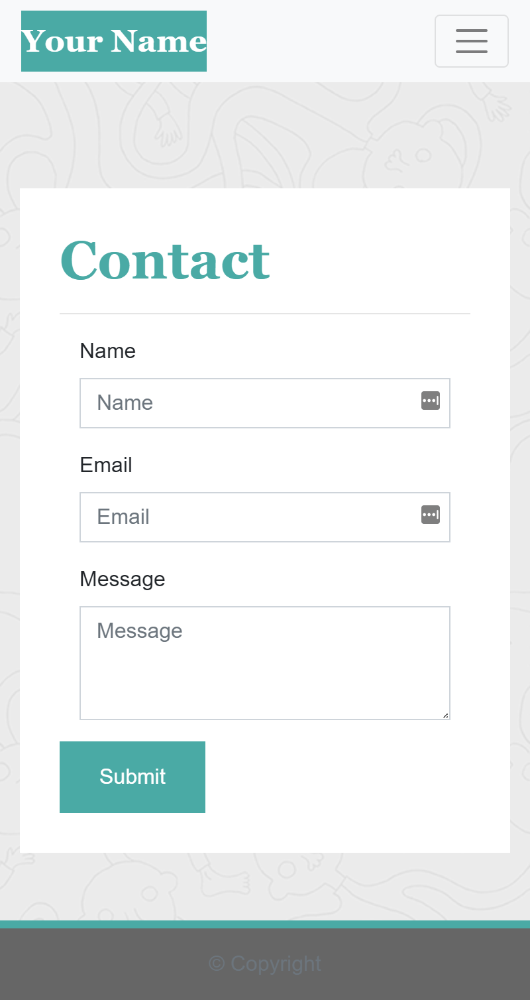
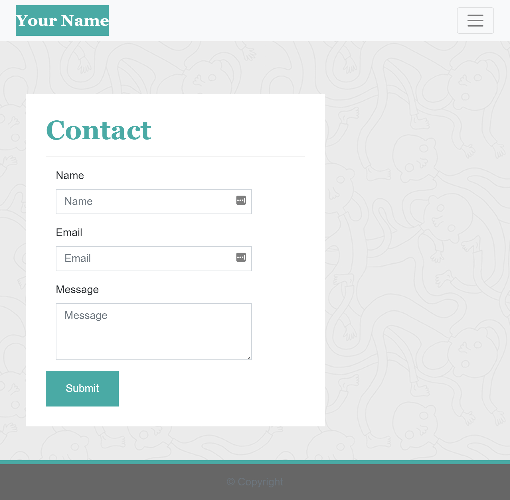

# Responsive Portfolio
**Version 1.0.0**
### In this Repo we were tasked to create a Responsive Portfolio from scratch. Using Bootstrap with a navbar, a responsive layout, and responsive images. Screen shoots of what the end result of my Responsive Portfolio should look like.
--- 
## TASKING
- [X] FUNCTIONAL, DEPLOYED APPLICATION
- [X] README
- [X] CONSISTENT NAVBAR ON EACH PAGE
- [X] NAVBAR LINKS WORK
- [X] ALL LINKS WORK
- [X] SEMANTIC HTML
- [X] EACH PAGE HAS VALID AND CORRECT HTML.
- [X] MUST CONTAIN PERSONALIZED INFORMATION
- [X] PROPERLY UTLIZE BOOTSRAP COMPONENTS AND GRAID SYSTEM
---
## LICENSE & COPYRIGHT
BOOTSTRAP LICENSE
https://github.com/twbs/bootstrap/blob/v4.5.2/LICENSE
The MIT License (MIT)

Copyright (c) 2011-2020 Twitter, Inc.
Copyright (c) 2011-2020 The Bootstrap Authors

Permission is hereby granted, free of charge, to any person obtaining a copy
of this software and associated documentation files (the "Software"), to deal
in the Software without restriction, including without limitation the rights
to use, copy, modify, merge, publish, distribute, sublicense, and/or sell
copies of the Software, and to permit persons to whom the Software is
furnished to do so, subject to the following conditions:

The above copyright notice and this permission notice shall be included in
all copies or substantial portions of the Software.

THE SOFTWARE IS PROVIDED "AS IS", WITHOUT WARRANTY OF ANY KIND, EXPRESS OR
IMPLIED, INCLUDING BUT NOT LIMITED TO THE WARRANTIES OF MERCHANTABILITY,
FITNESS FOR A PARTICULAR PURPOSE AND NONINFRINGEMENT. IN NO EVENT SHALL THE
AUTHORS OR COPYRIGHT HOLDERS BE LIABLE FOR ANY CLAIM, DAMAGES OR OTHER
LIABILITY, WHETHER IN AN ACTION OF CONTRACT, TORT OR OTHERWISE, ARISING FROM,
OUT OF OR IN CONNECTION WITH THE SOFTWARE OR THE USE OR OTHER DEALINGS IN
THE SOFTWARE.

&copy; ENRILO M. UGALDE, UCSD EXTENSION SEP 2020 - MAR 2021 COHORT
----
### LINKS
BODY BG provided by Vecteezy.com
#### EXAMPLE of What my Responsive Portfolio should look like.

